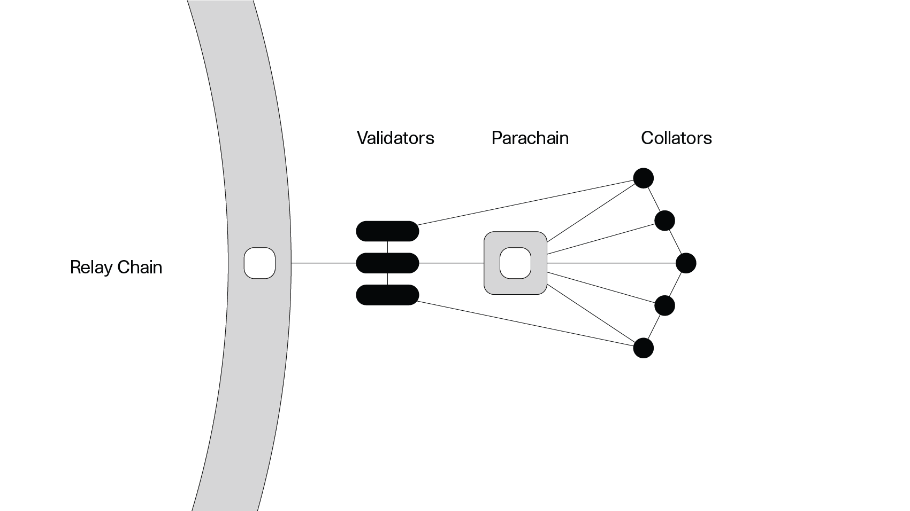

# Substrate Saturday Bootcamp by Polkadot India

This repository contains all the assignments, homeworks and problems discussed during the Substrate bootcamp hosted by Polkadot India.
[Substrate Bootcamp](https://lu.ma/ss2?tk=OzHtWq&utm_source=newsletter&utm_medium=sendy).
You can find the recorded videos here:


**Ownership rules:**
Rust uses a third approach: memory is managed through a system of ownership with a set of rules that the compiler checks. If any of the rules are violated, the program won’t compile. None of the features of ownership will slow down your program while it’s running.
* Each value in Rust has an owner.
* There can only be one owner at a time.
* When the owner goes out of scope, the value will be dropped.
  
 
**The Rules of References:**
* At any given time, you can have either one mutable reference or any number of immutable references.
* References must always be valid.
```
let mut x = 1;
let y = &x;
let z = &x;
let a = &mut x; // ERROR
```
```
let mut x = 2;
let a = &mut x;
println!("{}", a);
let b = &mut x;
```

**Patterns:**


There were 6 classes:
1. 9th July 2022 - Rust lesson 1 - 8
2. 16th July 2022 - Rust lesson 9 - 18 (17 optional)
3. 30th August 2022 - Substrate Node Template
4. 


### Networking Sessions:
* [23rd July 2022 - Extending Substrate Functionality with Custom Pallet by Ivan Temchenko, Senior Rust Engineer at Polkadex](https://twitter.com/_PolkadotIndia/status/1549080840822738944?s=20&t=9GfimlQ5DQmfS8v_Mjylog)


### What to do after completing Rust?
[Small projects with elegand code base](https://practice.rs/elegant-code-base.html)


### Strings

&str - immutable, fast and efficient, static, allocates space in stack
String::from() - mutable, stores in heap, String data structure, dynamic

Ex: 
```
x = "hello";
y = x;  
println!("{},{}",x,y);   // This works

x = String::from("hello");
y = x;  
println!("{},{}",x,y);   // This won't work
```

* Will lose memory once out of scope

* Use clone() when copying String else use copy instead

* utf8_slice
You can use utf8_slice to slice UTF8 string, it can index chars instead of bytes.
```
use utf8_slice;
fn main() {
   let s = "The 🚀 goes to the 🌑!";

   let rocket = utf8_slice::slice(s, 4, 5);
   // Will equal "🚀"
}
```

Array - static
Vector - dynamic

```
let x = vec![1,2,3]
x.push(5);
println!("{} {}", x.len(), x.capacity());
```


__By default, 4 bytes of capacity is allocated for vector__
```
let mut x = Vec::new();
x.push(1);
x.len(); // 1
x.capacity(); // 4
```

Attribute macros # = #[derive(Debug)]
Predefined macros ! = prinln!, format!

{:?} normal print
{:#>} pretty format

impl -> creating new functionality

traits -> extending a functionality. Ex: clone, copy, iterator

__Note:__ Traits are similar to interfaces in other languages, although with some differences.

* The impl Trait syntax works for straightforward cases but is actually syntax sugar for a longer form, which is called a trait bound.


# Blockchain

__Consensus Model:__ The method that a blockchain uses to batch transactions into blocks and to select which node can submit a block to the chain is called the blockchain's consensus model or consensus algorithm.  
__Ex:-__ proof-of-work consensus model - the node that completes a computational problem first has the right to submit a block to the chain.

__Smart Contract:__ A smart contract is a program that runs on a blockchain and executes transactions on behalf of users under specific conditions.

__Why Substrate?__
Substrate is Flexible, Open, Interoperable via XCM or bridges, Future-proof (This I won't believe). There are hard problems around scale, governance, interoperability, and upgradeability to address. Depends on what do you want to build? Substrate can be used in following situations:
* tailored to a very specific use case
* able to connect and communicate with other blockchains
* customizable with predefined composable modular components
* able to evolve and change with upgrades over time


__Relay Chain__: 

The Relay Chain is the central chain of Polkadot. All validators of Polkadot are staked on the Relay Chain in DOT and validate for the Relay Chain. The Relay Chain is composed of a relatively small number of transaction types that include ways to interact with the governance mechanism, parachain auctions, and participating in NPoS. The Relay Chain has deliberately minimal functionality - for instance, smart contracts are not supported. 


__Parachain__:
A parachain is an application-specific data structure that is globally coherent and validatable by the validators of the Relay Chain. They take their name from the concept of parallelized chains that run parallel to the Relay Chain. Most commonly, a parachain will take the form of a blockchain, but there is no specific need for them to be actual blockchains.


__Substrate Architecture:__
In a decentralized network, all nodes act as both clients that request data and as servers that respond to requests for data. 


* An outer node that handles network activity such as peer discovery, managing transaction requests, reaching consensus with peers, and responding to RPC calls.
* A runtime that contains all of the business logic for executing the state transition function of the blockchain. The runtime determines whether transactions are valid or invalid and is responsible for handling changes to the blockchain's state transition function.


__Network types:__

Substrate-based blockchains can be used in different types of network architecture. For example, Substrate blockchains are used to build the following network types:

* __Private networks__ that limit access to a restricted set of nodes.

* __Solo chains__ that implement their own security protocol and don't connect or communicate with any other chains. Bitcoin and Ethereum are examples of non-Substrate based solo chains.

* __Relay chains__ that provide decentralized security and communication for other chains that connect to them. Kusama and Polkadot are examples of relay chains.

* __Parachains__ that are built to connect to a relay chain and have the ability to communicate with other chains that use the same relay chain. Because parachains depend on the relay chain to finalize the blocks produced, parachains must implement the same consensus protocol as the relay chain they target.

__FRAME__ - Framework for Runtime Aggregation of Modularized Entities

__GHOST__ - Greedy Heaviest Observed SubTree

__Transactions:__ In general, transactions provide a mechanism for making changes to state that can be included in a block. There are three distinct transaction types in Substrate:

1. __Signed transactions__ - Signed transactions must include the signature of an account sending an inbound request to execute some runtime call. Typically, the request is signed using the private key for the account that is submitting the request. In most cases, the account submitting the request also pays a transaction fee. ```pallet_balances::Call::transfer```

2. __Unsigned transactions__ - Unsigned transactions don't require a signature and don't include any information about who submitted the transaction. ```pallet_im_online::Call::heartbeat ``` This function can only be called by a node that's registered as a validator in the network.

3. __Inherent transactions__ - sometimes referred to as inherents—are a special type of unsigned transaction. With this type of transaction, block authoring nodes can add information directly to a block. Inherent transactions can only be inserted into a block by the block authoring node that calls them. Typically, this type of transaction is not gossiped to other nodes or stored in the transaction queue. The data inserted using an inherent transaction is assumed to be valid without requiring specific validation. 
Ex: ```pallet_timestamp::Call::now``` unction enables a block authoring node to insert a current timestamp in each block the node produces. Similarly, the ```paras_inherent::Call::enter``` function enables a parachain collator node to send its relay chain the validation data the relay chain expects.

In Substrate, all three transaction types are often more broadly referred to as extrinsics. The term __Extrinsic__ is generally used to mean any information that originates outside of the runtime.


### Block
In Substrate, a block consists of a header and an array of transactions. The header contains the following properties:

* Block height
* Parent hash
* Transaction root
* State root
* Digest

__Transaction Lifecycle:__

In Substrate, transactions contain data to be included in a block. Because the data in transactions originates outside of the runtime, transactions are sometimes more broadly referred to as extrinsic data or as extrinsics. However, the most common extrinsics are signed transactions. Therefore, this discussion of the transaction lifecycle focuses on how signed transactions are validated and executed.


__Validating and queuing transactions:__
To reach consensus, two-thirds of the nodes must agree on the order of the transactions executed and the resulting state change. To prepare for consensus, transactions are first validated and queued on the local node in a transaction pool.

__Validating transactions in the transaction pool:__
Using rules that are defined in the runtime, the transaction pool checks the validity of each transaction. The checks ensure that only valid transactions that meet specific conditions are queued to be included in a block. For example, the transaction pool might perform the following checks to determine whether a transaction is valid:

* Is the transaction index—also referred to as the transaction nonce—correct?
* Does the account used to sign the transaction have enough funds to pay the associated fees?
* Is the signature used to sign the transaction valid?

__validate_transaction:__
This method is invoked by the transaction pool to learn details about given transaction. The implementation should make sure to verify the correctness of the transaction against current state. The given block_hash corresponds to the hash of the block that is used as current state.

__Adding valid transactions to a transaction queue__
If a transaction is identified as valid, the transaction pool moves the transaction into a transaction queue. There are two transaction queues for valid transactions:

1. The __ready queue__ contains transactions that can be included in a new pending block. If the runtime is built with FRAME, transactions must follow the exact order that they are placed in the ready queue.
2. The __future queue__ contains transactions that might become valid in the future. For example, if a transaction has a nonce that is too high for its account, it can wait in the future queue until the appropriate number of transactions for the account have been included in the chain.


__Invalid transaction handling__
If a transaction is invalid—for example, because it is too large or doesn't contain a valid signature—it is rejected and won't be added to a block. A transaction might be rejected for any of the following reasons:

* The transaction has already been included in a block so it is dropped from the verifying queue.
* The transaction's signature is invalid, so it is immediately be rejected.
* The transaction is too large to fit in the current block, so it is be put back in a queue for a new verification round.


__Transactions ordered by priority__
If a node is the next block author, the node uses a priority system to order the transactions for the next block. The transactions are ordered from high to low priority until the block reaches the maximum weight or length.

Transaction priority is calculated in the runtime and provided to the outer node as a tag on the transaction. In a FRAME runtime, a special pallet is used to calculate priority based on the weights and fees associated with the transaction. This priority calculation applies to all types of transactions with the exception of inherents. Inherents are always placed first using the ```fn ensure_inherents_are_first(block: &Block) -> Result<(), u32>``` trait. This fn ensures the position of inherent is correct, i.e. they are before non-inherents.


__Executing transactions__
After the block has been initialized, each valid transaction is executed in order of transaction priority. It is important to remember that the state is not cached prior to execution. Instead, state changes are written directly to storage during execution. If a transaction were to fail mid-execution, any state changes that took place before the failure would not be reverted, leaving the block in an unrecoverable state. Before committing any state changes to storage, the runtime logic should perform all necessary checks to ensure the extrinsic will succeed.

Note that events are also written to storage. Therefore, the runtime logic should not emit an event before performing the complementary actions. If a transaction fails after an event is emitted, the event is not be reverted.


### Block authoring and block imports

So far, you have seen how transactions are included in a block produced by the local node. If the local node is authorized to produce blocks, the transaction lifecycle follows a path like this:

1. The local node listens for transactions on the network.
2. Each transaction is verified.
3. Valid transactions are placed in the transaction pool.
4. The transaction pool orders the valid transactions in the appropriate transaction queue and the executive module calls into the runtime to begin the next block.
5. Transactions are executed and state changes are stored in local memory.
6. The constructed block is published to the network.


